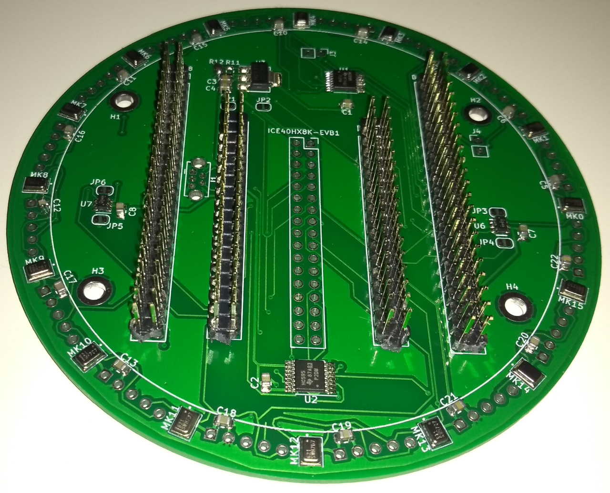
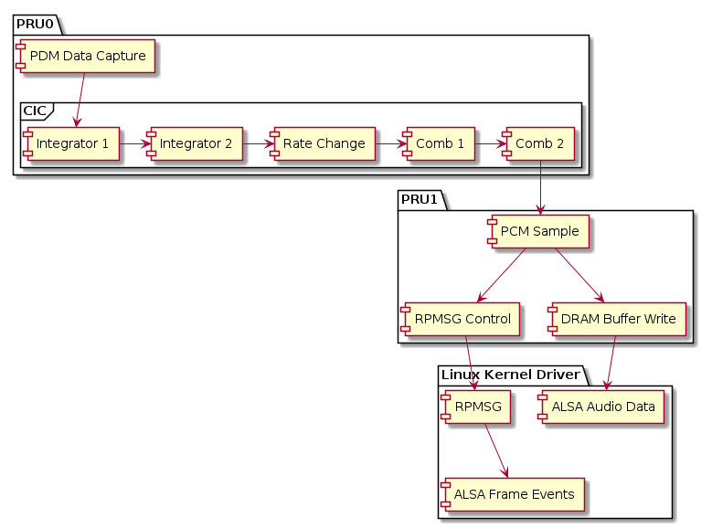

# BeagleMic 16-channel PDM Audio Capture

# Introduction
Ever wanted to record audio from 16 PDM microphones simultanously? Now you can with a BeagleMic running on a [PocketBeagle](https://beagleboard.org/pocket) or [BeagleBone AI](https://bbb.io/ai)

Yes, you could opt for the much simpler I2S microphones. But then you won't have fun writing assembly to capture and process sixteen digital signals at more than 2MHz sample rate.

Audio can be routed to BeagleBone's USB gadget driver. Multichannel audio data can be recorded from a regular PC just as you would record from any other USB microphone. See the section about Buildroot image below.

Current firmware supports:

| Feature                    | 16 Channel Mode   | 8 Channel Mode    |
|----------------------------|-------------------|-------------------|
| PDM Bit Clock              | 2,273 MHz         | 3,448 MHz         |
| PCM Output Bits Per Sample | 16 bps            | 24 bps            |
| PCM Output Sample Rate     | 31888 Samples/sec | 26940 Samples/sec |

# Freedom
To the best of my knowledge, the entire HW design is Open Hardware and designed with the libre KiCad software. The entire firmware stack is free software, and is built by free toolchains.

Please report any closed components you notice.

# Hardware
The schematic is simple. PDM microphones' digital outputs are connected directly to the PRU input pins. The PRU also drives the bit clock. I have tested on PocketBeagle and BeagleBone AI.

| PocketBeagle | BBAI  | PRU Pin | Type  | Signal               |
|--------------|-------|---------|-------|----------------------|
| P2.24        | P9.11 | R30_14  | Output| PDM Bit Clock        |
| P1.36        | P8.44 | R31_0   | Input | MIC0 and MIC1 Data   |
| P1.33        | P8.41 | R31_1   | Input | MIC2 and MIC3 Data   |
| P2.32        | P8.42 | R31_2   | Input | MIC4 and MIC5 Data   |
| P2.30        | P8.39 | R31_3   | Input | MIC6 and MIC7 Data   |
| P1.31        | P8.40 | R31_4   | Input | MIC8 and MIC9 Data   |
| P2.34        | P8.37 | R31_5   | Input | MIC10 and MIC11 Data |
| P2.28        | P8.38 | R31_6   | Input | MIC12 and MIC13 Data |
| P1.29        | P8.36 | R31_7   | Input | MIC14 and MIC15 Data |

Optionally, high-level software may visualize detected audio direction using a stripe of 16 LEDs hooked to two 74HC595 shift registers:

| PocketBeagle | PB GPIO  | BBAI  | BBAI GPIO | Signal |
|--------------|----------|-------|-----------|--------|
| P2.25        | gpio2_9  | P9.30 | gpio5_12  | DS     |
| P2.29        | gpio1_7  | P9.28 | gpio4_17  | SHCP   |
| P2.31        | gpio1_19 | P9.23 | gpio7_11  | STCP   |

For each microphone pair, one microphone is configured to output data on the rising clock edge, and the other is configured to output data on the falling edge. This way we need only 8 input GPIOs to capture data from all 16 microphones.

Microphone breakout board and a PocketBeagle Cape are provided in KiCad format.

Unfortunately the breakout board is essential for a home DIY user like me, since all PDM microphones I could find are BGA. There are numerous youtube guides how to solder BGAs at home using a skillet or a toaster oven.

# Software

PRU0 takes care of driving the PDM bit clock and capturing the microphone bit data. It then runs a CIC filter to convert PDM to PCM, and feeds PCM data to PRU1.

PRU0 has two alternative modes of operation. For 16 channels it executes 2 integrator and 2 comb stages for CIC filtering. Whereas for 8 channels it does 3.

PRU1 is retransmitting PCM data from PRU0 down to the ARM host. RPMSG is used for control commands. Shared DDRAM buffers are used for audio data.

Host audio driver presents a standard ALSA audio card, so that arecord and other standard tools can be readily used.

# Running The Example on PocketBeagle

    # Build kernel module
    sudo apt update
    sudo apt install build-essential linux-headers-`uname -r`
    cd driver
    make
    # Install kernel module
    sudo cp beaglemic.ko /lib/modules/`uname -r`/kernel/drivers/rpmsg/
    sudo depmod -a

    # Load the driver
    sudo modprobe beaglemic

    # Build PRU firmware
    cd pru
    make
    # Start the new PRU firmware
    sudo ./start.sh

    # Record audio
    arecord  -r31888  -c16 -f S16_LE -t wav out.wav
    arecord  -r26940  -c8 -f S32_LE -t wav out.wav
    # Hit Ctrl+C to stop.

# Running The Example on BeagleBone AI

    # Prebuilt DTBO for BB AI is provided in this repo. For corresponding
    # source change, see driver/0001-Initial-BeagleMic-DTS-for-BBAI.patch
    sudo cp driver/am5729-beagleboneai-beaglemic.dtb /boot/dtbs/`uname -r`/
    sudo sed -i -e 's@#dtb=@dtb=am5729-beagleboneai-beaglemic.dtb@g' /boot/uEnv.txt
    sync
    sudo reboot

    # Build kernel module
    sudo apt update
    sudo apt install build-essential linux-headers-`uname -r`
    cd driver
    make
    # Install kernel module
    sudo cp beaglemic.ko /lib/modules/`uname -r`/kernel/drivers/rpmsg/
    sudo depmod -a

    # Load the driver
    sudo modprobe beaglemic

    # Build PRU firmware
    cd pru
    make
    # Start the new PRU firmware
    sudo ./start-bbai.sh

    # Record audio. Use second audio card, since first one is
    # the onboard HDMI.
    arecord -D hw:CARD=BeagleMic -r31888  -c16 -f S16_LE -t wav out.wav
    arecord -D hw:CARD=BeagleMic -r26940  -c8 -f S32_LE -t wav out.wav
    # Hit Ctrl+C to stop.

# Folder Structure

 * beaglemic-cape - Universal cape for BeagleBone AI, PocketBeagle and iCE40HX8K-EVB.
 * driver - Host ALSA audio driver.
 * inmp621-breakout - INMP621 Microphone breakout. Designed to be optionally used with beaglemic-cape.
 * libs - Library code. Currently contains code to drive LED ring for beaglemic-cape.
 * pru - PRU firmware.

# Further Work
A few ideas to improve the design:

 * Move comb filters to PRU1, and try to add more integrators in PRU0.
 * Clean-up the cape PCB.
   * If possible, leave headers for Class-D output from spare PRUs.
 * Migrate to latest kernel 5.10.

# Buildroot Image With USB UAC2 Gadget Mode
The above installation and build instruction steps can be daunting. A [buildroot](https://buildroot.org) configuration for PocketBeagle is available to automate them, and add a bit more.

The buildroot image is small (about 6MB). It initializes the BeagleMic audio driver, and links it to the UAC2 USB Gadget driver. Your BeagleMic PocketBeagle is presented as USB multichannel microphone, so that a regular PC can capture and run desired audio algorithms.

You need to download the beaglemic and buildroot.org GIT trees in separate directories. Then, when building from the buildroot directory you need to provide the beaglemic path via BR2_EXTERNAL environment variable. Example commands:

	git clone --depth=1 git://git.busybox.net/buildroot
	git clone --depth=1 https://gitlab.com/dinuxbg/beaglemic

	cd buildroot
	git checkout 2021.05.3  # Last BR release with kernel 4.19
	export BR2_EXTERNAL=`realpath ../beaglemic/buildroot/`
	make beaglemic_pb_defconfig
	make -j`nproc`

Above should result in a small SDCard image which you can flash. Be sure to get the /dev/sdX right for your SD/MMC card reader.

	sudo dd if=output/images/sdcard.img of=/dev/sdX

When PocketBeagle boots and you connect it via USB to your host, you should be able to record:

	arecord -D hw:CARD=BeagleMic -c8 -t wav -f S32_LE -r24000 out-8ch.wav

## Audio Mode Configuration
Right now UAC2 Gadget is configured only for 8ch/32bps/24000kHz. With a few manual tweaks in buildroot/package/beaglemic-firmware/beaglemicd it can be switched to 16ch/16bps mode. I'm currently researching how I can make this configuration run-time, and how I can control the LED ring via USB.

# References
 * [CIC Filter Introduction](https://dspguru.com/dsp/tutorials/cic-filter-introduction/)
 * [Another CIC Filter Article](http://www.tsdconseil.fr/log/scriptscilab/cic/cic-en.pdf)
 * [Series of PDM articles and software implementations](https://curiouser.cheshireeng.com/category/projects/pdm-microphone-toys/)
 * [Another CIC Filter Article](https://www.embedded.com/design/configurable-systems/4006446/Understanding-cascaded-integrator-comb-filters)
 * [CIC Filter Introduction](http://home.mit.bme.hu/~kollar/papers/cic.pdf)
 * [SPM0423HD4H Datasheet](http://media.digikey.com/PDF/Data Sheets/Knowles Acoustics PDFs/SPM0423HD4H-WB.pdf)
 * [INMP621 Datasheet](https://invensense.tdk.com/download-pdf/inmp621-datasheet/)
 * [Inspiration for high-bandwidth data acquisition](https://github.com/ZeekHuge/BeagleScope)

# Other Resources
Below are various other CIC implementations and PDM microphone boards I've stumbled upon.
 * https://github.com/introlab/16SoundsUSB
 * https://github.com/introlab/odas
 * https://respeaker.io/make_a_smart_speaker/
 * https://github.com/Scrashdown/PRU-Audio-Processing
 * https://github.com/fakufaku/kurodako
