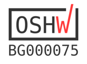

# Beaglemic-Cape

This is a KiCAD project for a 16 PDM Microphone board with host support for:
 * BeagleBone AI
 * PocketBeagle
 * ICE40HX8K-EVB1 (**untested!**)

PDM microphones can either be:
 * Soldered on the cape board, which is not for beginners. You would require a steady hand or pick-and-place machine, and reflow soldering oven.
 * Connected via regular headers using external [breakout](../inmp621-breakout/README.md) [board](https://www.adafruit.com/product/3492).

# Future Improvements

A few ideas for improvements in an eventual future PCB revision:

 * Move the USB OTG connector to the outer edge, so that cable does not interfere with PocketBeagle.
 * Add a few extra LEDs for power and other status.
 * Add better package placement indicators on silkscreen (e.g. first pin, IC dent).

# References
 * Microphone footprint, 3D model and schematics symbol are taken from https://www.snapeda.com/parts/INMP621/InvenSense/view-part/?ref=digikey . Footprint has minor modification to "break" the ground track and ease the data wires routing.
 * Freerouting.org was used for routing some of the PCB tracks.
